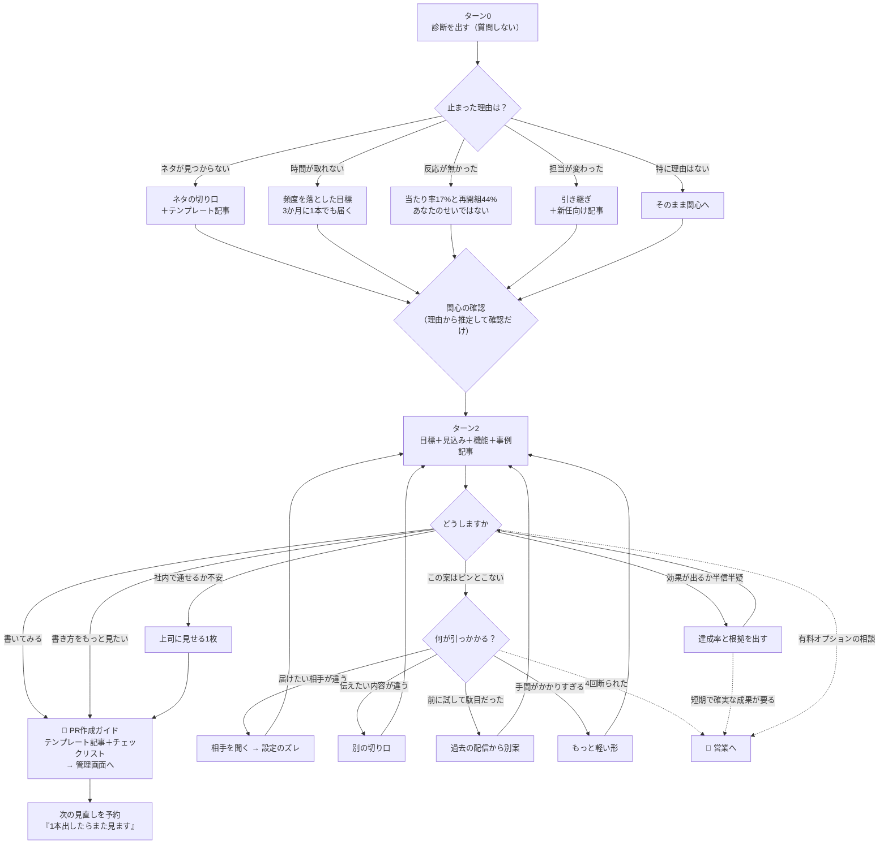

# 分析フロー（対話と、その裏で走る集計）

商談の型・実データ・マガジン1,188本を1本に繋いだもの。
各ノードに「何を見せるか」「どのデータで裏を取るか」「どこで分岐するか」を書いてある。

---

## 全体



**出口は「書く」。営業は点線＝例外ルート。**

---

## ターン0 — 診断（質問しない）

**原則：最初の一言で価値を返す。** 相手が何も答えていない時点で、知らなかった事実を渡す。

| 見せるもの                                             | データ源                                | 状態    |
| ------------------------------------------------------ | --------------------------------------- | ------- |
| 配信本数・停止期間・実際のリリース名                   | `release` / `release_statistic`         | ✅ 確定 |
| 配信本数別の当たり率カーブ（17%→87%）                  | 業種内 PV上位10% を「当たり」として集計 | ✅ 確定 |
| 御社の現在地（カーブ上のどこか）                       | 自社の本数から                          | ✅ 確定 |
| **同じところで止まって戻ってきた企業（4,291社・44%）** | 6か月以上の空白後の再開を追跡           | ✅ 確定 |

**言うこと**

> 1本で止まっているのは御社だけではありません。同じ業種で1本だけ配信した企業のうち、
> 手応えのある結果に届いたのは17%。**反応が無かったのは本数の問題です。**
> そして同じところで止まった4,291社が再開していて、**中央値でたった3本追加しただけで44%**が届いています。

---

## ターン0.5 — 止まった理由を聞く（商談の①）

商談は必ずここから始まる。「どうしましたか」ではなく**前回の配信を指して**聞く。

```
前回「（実際のリリースタイトル）」を出されてから止まっています。
何が引っかかりましたか？

[出すネタが見つからない]  [時間が取れない]  [出しても反応が無かった]
[担当が変わった／引き継いでいない]  [特に理由はない]
```

**この1問が処方を分ける。** いまは全員に同じ話をしている。

| 理由               | 続けて出すもの                      | マガジンの絞り込み                                |
| ------------------ | ----------------------------------- | ------------------------------------------------- |
| ネタが見つからない | 商品告知は埋もれる → 切り口を変える | `purpose=情報発信を充実` ＋ テンプレート記事      |
| 時間が取れない     | 3か月に1本でも9か月で3本            | `level=ビギナー` ＋ テンプレート                  |
| 反応が無かった     | 当たり率17%／再開組44%              | `purpose=ブラッシュアップ` ＋「読まれるタイトル」 |
| 担当が変わった     | 引き継ぎ・ログイン管理              | `level=イントロダクション` ＋「新任担当者は必読」 |
| 特に理由はない     | そのまま関心へ                      | —                                                 |

---

## ターン1 — 関心は「聞く」ではなく「確認する」

理由が分かれば関心はほぼ推定できる。**質問を1つ減らせる。**

| 理由               | 推定される関心           | 確認の仕方                                       |
| ------------------ | ------------------------ | ------------------------------------------------ |
| ネタが見つからない | `topic`（何を出すか）    | 「まず何を出すかから決めましょうか？」           |
| 反応が無かった     | `pv`（もっと見られたい） | 「もっと読まれる形にしたい、で合っていますか？」 |
| 担当が変わった     | `topic`                  | 「まず1本出すところから、で合っていますか？」    |
| 時間が取れない     | `topic`（軽い形）        | 同上                                             |

**外れていたら4択を出す。** 当たっていれば往復が1つ減る。

---

## ターン2 — 目標・見込み・機能・事例を一度に

分割しない。**ここで初めて「あと3本」という目標が出る。**

### ① 目標

> **あと3本。**
> 同じところで止まってから再開した4,291社の中央値。ここまでで44%が手応えを得ている。
> 月1本なら3か月、3か月に1本でも9か月。

✅ 確定（再開企業の追跡）

### ② 時間では上がらない

| 経過  | 当たり率 | 配信本数の中央値 |
| ----- | -------- | ---------------- |
| 3か月 | 13%      | 1本              |
| 1年   | 16%      | 2本              |
| 3年   | **23%**  | **4本**          |

**3年経っても23%。本数で見た87%とは別物。** 中央値の企業が3年で4本しか出していないため。

✅ 確定

### ③ その商品をどう出すか（商談の④）

統計を出すだけでは「商品の話」が消える。**障害 → 仕組み → 数字**の順で言う。

> 商品サービスの告知は、この業種で最も多く出されている形です（442,128本）。
> 数が多いぶん埋もれやすく、跳ねたときも52PV。
> 一方「調査レポート」の形は79PVまで伸びています。
> **商品を変える話ではなく、商品を説明する前にその商品が解決している問題を先に出す、という順番の違いです。**

✅ 確定（種別ごとの上位10%）

### ④ 使うとよい機能 ＋ 実測の差

| 打ち手                   | 使用時 | 未使用時 | 差        |
| ------------------------ | ------ | -------- | --------- |
| メイン画像               | 10.3%  | 4.4%     | **2.3倍** |
| （同一企業内の前後比較） | 8.1%   | 1.7%     | **4.8倍** |
| キーワード3件以上        | 10.8%  | 6.3%     | 1.7倍     |
| タイトルに数字           | 11.3%  | 8.9%     | 1.3倍     |

✅ 確定。**同一企業内比較があるので「丁寧な企業ほど使う」というバイアスは排除済み**

### ⑤ 事例記事

マガジン1,188本から、**業種 × 種別 × 分岐**で3本選ぶ。

> 「ソフトウェア新製品のプレスリリースの書き方｜配信する3つのメリット＆配信事例5選」

✅ 確定（`src/magazine.js`）。テンプレート記事67本は**書き方と配信事例がセット**

---

## ターン2のあと — 反応は1種類ではない

「いく／いかない」の2択では拾えない。**実際に返ってくる反応**を4つに束ねる。

```
[この方向で書いてみる]      → PR作成ガイドへ（主導線）
[書き方をもっと見たい]      → PR作成ガイドへ（記事を厚めに）
[社内で通せるか不安]        → 上司に見せる1枚 → そのあと作成ガイドへ
[この案はピンとこない]      → 何が引っかかるかを4型で聞く（下記）
[効果が出るか半信半疑]      → 達成率と根拠を出す → 戻る
```

**主導線は「書いてみる」。** ここに寄せる。

### 社内で通せるか不安 — 上司に見せる1枚

止まる原因の多くは担当者の意欲ではなく、**社内で時間を確保できないこと**。
そのまま転送できる形で出す。

| 載せるもの                         | 数字                          |
| ---------------------------------- | ----------------------------- |
| 同じ状況の企業がどうなったか       | 1本で17% / 21本以上で87%      |
| 同じところから再開した企業         | 4,291社・44%・追加は中央値3本 |
| 提案する目標                       | あと3本（月1本なら3か月）     |
| 時間をかけるだけでは上がらないこと | 3年経っても23%                |

**担当者の主観を1つも入れない。** 数字と出典だけで構成する。

### 効果が出るか半信半疑 — 根拠を出す

疑いは正当。**押し返さず、材料を足す。**

- 3か月以内の達成率（50PV以上12.5% / 200PV以上2.4%）
- 同一企業内の前後比較（画像を使い始めた前後で 1.7% → 8.1%）
- 何社・何本を根拠にしているか

**ここで数字が足りなければ、それは提案が弱いということ。** 押し切らない。

---

## 📝 PR作成ガイド（主要な出口）

**ここがゴール。** 会話の目的は納得させることではなく、1本書いてもらうこと。

| 出すもの               | 中身                                                       |
| ---------------------- | ---------------------------------------------------------- |
| **書き方の記事**       | 業種×種別で選んだテンプレート記事（書き方＋配信事例N選）   |
| **チェックリスト**     | 実測の差つき。下記                                         |
| **今回の具体案**       | 種別と切り口（「商品の前に、解決している問題を先に出す」） |
| **作成画面へのリンク** | PR TIMES管理画面                                           |

### チェックリスト（実測の差つき）

| 項目                     | 差                                         | 出し方                           |
| ------------------------ | ------------------------------------------ | -------------------------------- |
| メイン画像を付ける       | 4.4% → 10.3%（同一企業内では 1.7% → 8.1%） | 常に出す                         |
| キーワードを3件以上      | 6.3% → 10.8%                               | 常に出す                         |
| カテゴリが未設定でないか | **0件0.4% → 1件10.9%**                     | 0件のときだけ                    |
| タイトルに数字を入れる   | 8.9% → 11.3%                               | 常に出す                         |
| 地域指定                 | 9.4% → 13.9%                               | **相手が地域を意識したときだけ** |

**「〜すると上がります」ではなく「〜しているリリースは差があります」と書く。** 相関であって因果ではない。

### 出したあと

```
出せたら教えてください。次はそのリリースの結果を見て、次の1本を決めます。
```

**1本で終わらせない。** 次の診断を予約するところまでが伴走。

---

## 👤 営業へ渡す条件（例外ルート）

**既定では渡さない。** 人間でなければ進まない場合に限る。

| 条件                                                        | 理由                                             |
| ----------------------------------------------------------- | ------------------------------------------------ |
| **相手が「人と話したい」と言った**                          | 回数に関係なく即座に渡す                         |
| 有料オプション・別サービスの相談（PR TIMES TV / LIVE など） | 契約の話はAIでは進められない                     |
| **短期で確実な成果が必要**（広告など他手段の検討）          | PR TIMES以外の提案になる                         |
| **提案を4回断られた**                                       | 手を変えても届かない。深掘りが必要でAIの手に余る |
| 「うちは事情が特殊で」と言われた                            | 個別事情の聞き取りが要る                         |
| 社内の複数部署を巻き込む必要がある                          | 調整は人間の仕事                                 |

渡すときに一緒に送るもの：

- 診断（本数・停止期間・現在地）
- **止まった理由**
- **断られた提案とその理由**（ここが一番価値がある）
- 届けたい相手
- 設定の不備

**商談の①〜⑦をAIが先にやった状態で渡す。** 営業の初動が変わる。

---

## 断られたときの分岐（商談の⑥⑦）

商談では提案が一度断られ、**その理由から本当のニーズが出た**。断りを情報にする。

```
[それだと弱い気がする]
  ↓ 何が引っかかりますか
  ├ 届けたい相手が違う           → 相手を聞く → 設定のズレを見る
  ├ 伝えたい内容が違う           → 別の種別で出し直す
  ├ 前に似たことを試して駄目だった → 過去の配信内容を見て別案
  └ 手間がかかりすぎる           → もっと軽い形（短いリリース／既存素材の流用）
```

**4型に正規化しておけば、商談の事案（相手が違う）は1ケースとして収まる。** 他の事案も拾える。

### 断られるたびに手を変える

回数で機械的に切ると、同じ提案の言い換えを繰り返すだけになる。
**断られた回数に応じて、出すものの種類を変える。**

| 回数  | 出すもの                                                           | 狙い                                   |
| ----- | ------------------------------------------------------------------ | -------------------------------------- |
| 1回目 | **別の切り口**（種別を変える／届ける相手を変える）                 | 中身の問題として扱う                   |
| 2回目 | **もっと軽い形**（短いリリース・既存素材の流用・過去記事の再構成） | 手間が理由かもしれない                 |
| 3回目 | **他社が実際にどうしたか**（マガジンの配信事例をそのまま見せる）   | 抽象的な提案をやめて実例に切り替える   |
| 4回目 | **営業へ渡す**                                                     | ここまで届かないなら、対話では解けない |

**同じ引き出しを4回開けない。** 1回ごとに角度を変え、最後は実例に落とす。
それでも駄目なら、それは深掘りが必要だという情報そのものになる。

なお、相手から「担当の人と話したい」と言われた場合は**回数に関係なくすぐ渡す**。

---

## 設定のズレ（商談の⑧）

商談の決め手は「掲載媒体がデフォルトのまま」の指摘だった。

**ただし「デフォルト＝悪」ではない。** 地域を絞らないほうがいい企業のほうが多い。
条件を2つ課す。

1. **相手が明示的に言ったときだけ**（「特定の地域に届けたい」等）
2. **データで差が確認できたものだけ**

✅ 検証済み（2026-08-14）。

| 設定     | 結果                          | 判断                                             |
| -------- | ----------------------------- | ------------------------------------------------ |
| 地域指定 | あり13.9% / なし9.4%（1.5倍） | **実装する。**ただし相手が地域を意識したときだけ |
| カテゴリ | 0件0.4% / 1件10.9% / 2件10.2% | **「増やす」は誤り。**0件のときだけ指摘する      |

カテゴリは当初「多いほど拾われる経路が増える」と想定していたが、**1件と2件で差が無かった**。
効くのは 0→1 だけ（27倍）。

---

## 勧めない判断

> 短期的に伸ばしたいなら、プレスリリースではなく広告のほうがいい

**言い切らない。達成率を数字で出して、判断は相手に委ねる。**

```
❌ 「1本で一気に広がる媒体ではありません」        ← こちらの意見
⭕ 「3か月以内に200PV以上に届いた企業は◯%でした」  ← 事実
```

✅ 検証済み（2026-08-14）。3か月以内・22,028社・平均配信2.3本。

| 目標              | 達成した企業 |
| ----------------- | ------------ |
| 1本でも50PV以上   | 12.5%        |
| 1本でも200PV以上  | **2.4%**     |
| 1本でも1000PV以上 | **0.3%**     |
| 累計500PV以上     | 1.2%         |

**ここは他社が持っていないデータなので、プロダクトの特色になる。**

---

## 営業へ渡す（第5章）

深掘りが要るところまで来たら、AIで完結させない。

渡すもの：

- 診断（本数・停止期間・現在地）
- **止まった理由**（ターン0.5）
- **断られた提案とその理由**（あれば）
- 届けたい相手（聞けていれば）
- 設定の不備（検出できていれば）

**営業の初動が変わる。** 商談の①〜⑦を、AIが先にやっておく形になる。

---

## データの確定状況

|                                     | 状態 |
| ----------------------------------- | ---- |
| 当たり率カーブ（17%→87%）           | ✅   |
| 再開企業の追跡（4,291社・44%・3本） | ✅   |
| 期間別（3年で23%）                  | ✅   |
| 種別ごとの跳ねやすさ                | ✅   |
| 打ち手の効果差分（画像2.3倍ほか）   | ✅   |
| 同一企業内の前後比較（4.8倍）       | ✅   |
| マガジン記事の選択                  | ✅   |
| 地域・カテゴリの効果                | ✅   |
| 目標水準別の達成率                  | ✅   |

**検証待ちはゼロ。** すべての数字が実データで裏付けられた。

---

## 実装の分担（案）

|                                | 担当                   | 触るファイル                   |
| ------------------------------ | ---------------------- | ------------------------------ |
| ターン0.5（止まった理由）      | 未定                   | `turns.js` `public/index.html` |
| 関心の推定・確認               | 未定                   | `turns.js`                     |
| マガジン記事の接続             | 済（選択ロジックのみ） | `src/magazine.js` ✅           |
| 音声の話し言葉化               | 別セッション           | `script.js`                    |
| 断りの4型                      | 未定                   | `turns.js` `public/index.html` |
| **PR作成ガイド（主要な出口）** | 未定                   | `turns.js` `magazine.js`       |
| 上司に見せる1枚                | 未定                   | 新規                           |
| 営業ハンドオフ（条件付き）     | 未定                   | 新規                           |

`turns.js` に集中するので、**誰か1人がまとめて入れるのが早い。**
